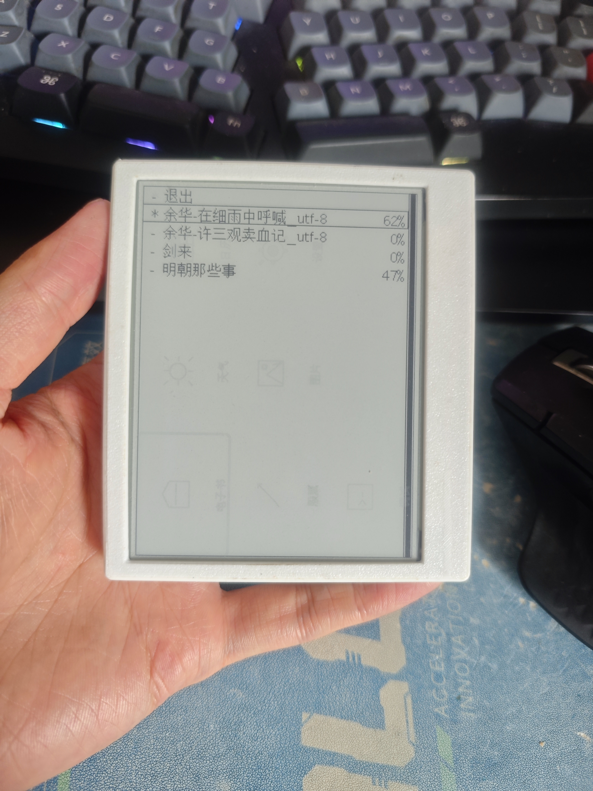
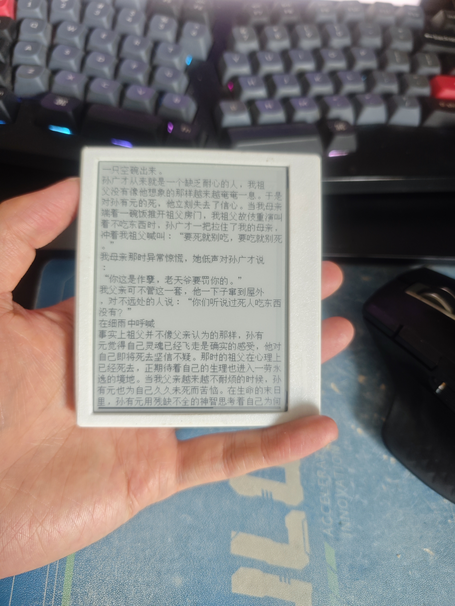

# EPD Reader

基于 ESP32-C3 的电子墨水屏阅读器，使用 Rust `#![no_std]` 嵌入式开发。

支持 WiFi 配网、NTP 时间同步、TXT 电子书阅读、天气预报、农历/节假日显示、沪深股票行情、BMP 图片浏览、IP 自动定位、自动休眠、Web 配置等功能。

硬件设计：https://oshwhub.com/longxiangam/epd_reader

详细设计文档：[DESIGN.md](DESIGN.md)

## 界面展示

<table>
  <tr>
    <td align="center"><br>主菜单</td>
    <td align="center"><br>书架 / 进度</td>
    <td align="center"><br>电子书阅读</td>
  </tr>
  <tr>
    <td align="center"><br>天气预报</td>
    <td align="center"><br>农历日历</td>
    <td align="center"><br>股票分时</td>
  </tr>
  <tr>
    <td align="center"><br>实时行情盘口</td>
    <td align="center"><br>图片浏览</td>
    <td align="center"><br>设置</td>
  </tr>
  <tr>
    <td align="center"><br>扫码配网</td>
    <td></td><td></td>
  </tr>
</table>

## 功能

| 功能 | 说明 |
|------|------|
| 电子书阅读 | TXT 文件自动分页、书签管理、进度保存 |
| 天气显示 | 心知天气 / OpenMeteo 双数据源，5 日预报 + 温度曲线，支持 IP 自动定位 |
| 农历日历 | 公历/农历对照，节气，节假日 + 补班标记，附 3 日天气 |
| 股票行情 | 沪深股票分时 / 日K / 周K / 月K / 折线 + 实时盘口，多股切换、按周期自动刷新 |
| 图片浏览 | BMP 图片查看，可设为待机壁纸 |
| WiFi 配网 | AP 模式热点，手机扫码配网，Web 管理界面 |
| NTP 时间 | 自动同步网络时间，深度睡眠后 RTC 恢复 |
| 电量与显示 | ADC 电池采样与百分比显示，全刷间隔 / 默认主页 / 各页睡眠时长可配置 |
| 低功耗 | 自动深度睡眠，按键/定时器唤醒，外设电源独立控制 |
| 错误日志 | 自定义 Panic Handler，崩溃信息写入 Flash |

## 硬件要求

| 组件 | 规格 |
|------|------|
| MCU | ESP32-C3 (RISC-V, 160MHz, 400KB SRAM, 4MB Flash) |
| 显示屏 | Waveshare 2.9" (296×128) 或 4.2" (400×300) 电子墨水屏 |
| 存储 | MicroSD 卡 (≤32GB, SD/SDHC, MBR 分区) |
| 输入 | 按键 ×3 (其中一个通过 ADC 分压实现两键) |
| 电源 | 锂电池 + ADC 电压检测 |

## 技术栈

- **语言**: Rust Edition 2024 (nightly), `#![no_std]`
- **目标**: `riscv32imc-unknown-none-elf`
- **HAL**: esp-hal v1.1.0
- **WiFi**: esp-radio v0.18.0
- **异步**: Embassy (executor v0.10, net v0.9, sync v0.8)
- **RTOS**: esp-rtos v0.3.0
- **图形**: embedded-graphics v0.8
- **字体**: u8g2-fonts (GB2312 中文)
- **文件系统**: embedded-sdmmc v0.9.0
- **HTTP/TLS**: reqwless v0.14 + embedded-tls v0.18

## 构建

```bash
# 安装工具链
rustup target add riscv32imc-unknown-none-elf
cargo install espflash

# 构建 4.2 寸版本并烧录
cargo run --features epd4in2

# 构建 2.9 寸版本
cargo run --features epd2in9

# 带调试模式（启动时检查错误日志）
cargo run --features "epd4in2,enable_debug"
```

## 项目结构

```
src/
├── main.rs              # 入口与硬件初始化
├── display.rs           # 电子墨水屏渲染服务
├── event.rs             # 事件系统（按键检测 + 发布-订阅）
├── wifi.rs              # WiFi STA/AP 模式（esp-radio）
├── storage.rs           # Flash 持久化存储
├── sleep.rs             # 深度睡眠与唤醒
├── worldtime.rs         # NTP 时间同步
├── weather.rs           # 天气数据服务
├── location.rs          # 基于 IP 的地理位置（自动定位天气城市）
├── request.rs           # HTTP/HTTPS 客户端
├── battery.rs           # 电池 ADC 采样
├── epd2in9_txt.rs       # TXT 文本分页引擎
├── sd_mount.rs          # SD 卡文件系统
├── flash_sleep.rs       # 待机壁纸 Flash 存储
├── web_service.rs       # WiFi 配网 Web 服务
├── panic.rs             # 自定义 Panic Handler
├── model/               # 数据模型（天气、农历、节假日、股票）
├── widgets/             # UI 组件（图标网格、列表、日历、K 线/图表等）
└── pages/               # 页面（主菜单、书架、阅读、天气、日历、股票、图片、设置、调试）
```

## 工具脚本

`tools/` 目录下提供辅助工具，依赖 Python 3 + Pillow (`pip install Pillow`)。

### bmp_converter.py — 睡眠图片转换工具

GUI 工具，将任意图片转换为 300×400 单色 BMP，用于电子墨水屏的待机界面。

```
python tools/bmp_converter.py
```

- 支持选择图片、实时预览转换效果
- 二值化方式：Floyd-Steinberg 抖动（推荐）/ 简单阈值
- 支持阈值调节和反色
- 输出 BMP 文件通过 Web 配网或 SD 卡写入 Flash

### download_weather_icons.py — 天气图标下载

从 [QWeather Icons](https://github.com/qwd/Icons) 下载 SVG 天气图标，转换为 32×32 单色 BMP 存放到 `icons/weather/` 目录，供天气页面使用。

```
python tools/download_weather_icons.py
```

- 需要同目录下的 `resvg.exe`（SVG → PNG 渲染引擎）
- 自动下载 → PNG 渲染 → 灰度缩放 → 二值化 → BMP 保存
- 覆盖 20 种天气类型（晴、阴、雨、雪、雾、霾等）

### convert_default_sleep.py — 默认待机图片生成

将 `files/sleep.bmp` 转换为原始 1-bit 像素二进制文件 `files/sleep_default.bin`，通过 `include_bytes!` 编译进固件作为默认待机画面。

```
python tools/convert_default_sleep.py
```

- 无需 GUI，命令行直接运行
- 输出 300×400 分辨率的打包像素数据（每行 38 字节，共 15200 字节）

## 已知限制

- SD 卡只支持 ≤32GB 的 SD/SDHC 类型，分区表须为 MBR
- SD 卡上电后需通信一次，否则对 SPI 显示通信有干扰

## 许可证

MIT License
